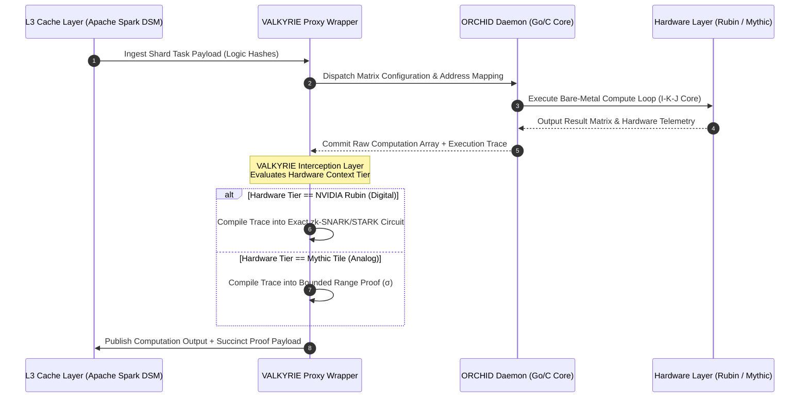

# 🛡️ Project VALKYRIE

### Verification-layer for Autonomous Logic, Kryptographic Validity, and Range-Inference Execution

[](#)
[](#)
[](#)

Project **VALKYRIE** is the decentralized verification layer of the RAMNET protocol. It functions as a non-interactive, zero-knowledge, and range-inference cryptographic filter wrapper positioned between the bare-metal execution daemon (**ORCHID**) and the distributed shared memory (**L3 Cache Layer**).

> [!NOTE]  
> **Standalone Architecture:** While VALKYRIE was designed to verify execution integrity across the RAMNET compute mesh, its dual-route proving backend can be utilized independently to verify high-throughput deterministic execution traces alongside noisy, range-bounded analog computations.

---

## 📈 Core Strategy: The Dual-Route Proof Engine

Rather than forcing a single arithmetic constraint system to handle both digital and analog architectures which introduces high circuit bloat VALKYRIE routes proof compilation based on the target hardware context:

### 1. The Digital Route: Exact Arithmetic Circuitry (zk-SNARK/STARK)

- **Target Hardware:** NVIDIA Rubin digital clusters.
- **Mechanism:** Bit-for-bit exact parity ($C[i][j] = \sum A[i][k] \times B[k][j]$). ORCHID execution traces are compiled into R1CS or AIR constraints, producing a succinct proof validating the logic hash.

### 2. The Analog Route: Range-Bounded Circuitry

- **Target Hardware:** Mythic Analog Matrix Tiles.
- **Mechanism:** To account for analog electrical charge variations and precision drift ($\sigma$), the engine shifts to a **zk-Bounded Range Proof** constraint set (e.g., using Vector Commitments/Bulletproofs). It verifies that the observed matrix outputs fall within the calibrated standard deviation:

$$\text{Pr}\left(|C_{\text{observed}} - (A \times B)_{\text{ideal}}| \leq z_{\alpha/2} \cdot \sigma\right) = 1 - \alpha$$

---

## 🏛️ Repository Architecture & Directory Map

```text
VALKYRIE/
├── circuits/                    # Zero-Knowledge & Range-Proof arithmetic constraint sets
│   ├── digital_exact/           # R1CS/AIR circuits for bit-for-bit digital validation
│   └── analog_range/            # zk-Bounded range gates matching σ hardware matrices
├── pkg/
│   ├── prover/                  # Logic for compiling ORCHID traces into succinct proofs
│   └── verifier/                # L3 Cache-Layer validation logic gates
├── cmd/
│   └── valkyrie-proxy/          # Go-native verification proxy wrapper for local nodes
├── README.md                    # This documentation file
├── go.mod                       # Valkyrie independent module definition
└── Makefile                     # Developer control panel for compiling and testing circuits
```

---

## ⚡ System Flow & Integration Topology

VALKYRIE acts as a secure, non-interactive gatekeeper between the L3 Distributed Shared Memory (DSM) and the local ORCHID execution node.



---

## 📋 Execution Trace Specification & Transport

To preserve ORCHID's mandate of zero-overhead processing, execution traces generated by the execution daemon are handed off to VALKYRIE using a specialized zero-copy transport layer.

### 1. Transport Layer: Zero-Copy Shared Memory (IPC)

- **Production Mode:** ORCHID writes state transitions directly into a shared-memory mapped block (`mmap` anonymous or mapped to a `/dev/shm` buffer). VALKYRIE reads this segment asynchronously. This guarantees zero disk I/O latency and zero-copy data handoff.
- **Debug Mode:** Optional file write (enabled via CLI flag, e.g., `--trace-out=trace.json --trace-format=json`).

### 2. Format: Binary Trace Vector

For production validation, trace outputs are serialized as standard binary vectors (using MsgPack or FlatBuffers) rather than JSON to avoid the high overhead of text parsing inside the arithmetic circuits.

### 3. Trace Schema Blueprint

The trace log maps the step-by-step state changes of registers and memories required for ZK circuit verification:

```json
{
  "header": {
    "task_id": "0x5f3e9c...",
    "logic_hash": "0x7a2b9d...",
    "input_commitments": ["0xa1b2...", "0xc3d4..."],
    "hardware_tier": "digital_exact"
  },
  "steps": [
    {
      "step": 0,
      "op": "VLOAD",
      "addr": "0x7ffd98e...",
      "val": [1.5, 2.3, 0.0, -1.2, 5.4, 0.1, 2.2, 3.3]
    },
    {
      "step": 1,
      "op": "VMUL_ACC",
      "reg_in": 0,
      "reg_accum": 1,
      "val": [3.0, 4.6, 0.0, -2.4, 10.8, 0.2, 4.4, 6.6]
    }
  ],
  "footer": {
    "output_commitment": "0xe5f6..."
  }
}
```

---

## 🚀 Development Control Panel: `Makefile`

VALKYRIE contains a standardized `Makefile` to compile circuits, run provers, and test verification gates:

### 1. Compile Proving Circuits (`make compile-circuits`)

Compiles the R1CS and range-bounded circuits under `circuits/`.

### 2. Run Verifier Tests (`make test`)

Executes unit tests verifying both the exact digital proofs and range-bounded validation logic.

### 3. Build Proxy Daemon (`make build`)

Compiles the `valkyrie-proxy` binary into `build/valkyrie-proxy`.

---

## 🐳 Production Containerization (Docker)

VALKYRIE can be compiled and run inside a security-hardened `distroless/cc-debian12` container.

### Build the Container (Execute from workspace root)
```bash
docker build -t valkyrie-proxy -f VALKYRIE/Dockerfile .
```

### Run the Container
```bash
docker run -d -p 9001:9001 --name valkyrie-service valkyrie-proxy
```

---

## 📖 Detailed Production Architecture

For a deep-dive analysis of deployment topologies (sidecar vs. asymmetrical mesh), multi-stage Docker sandboxing, and 3-way matrix sharding splits, refer to the [VALKYRIE Architectural Specification](docs/ARCHITECTURE.md).

---

_"Intelligence requires every available joule."_
