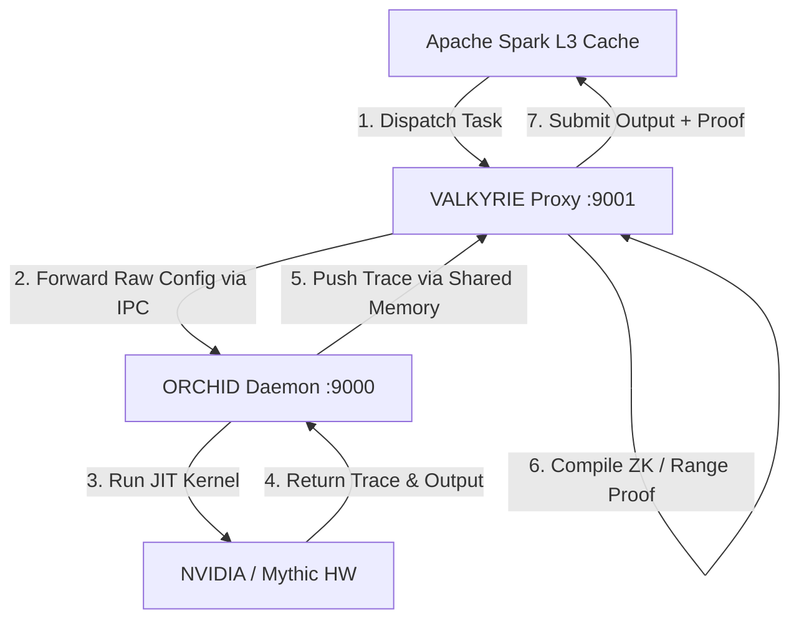
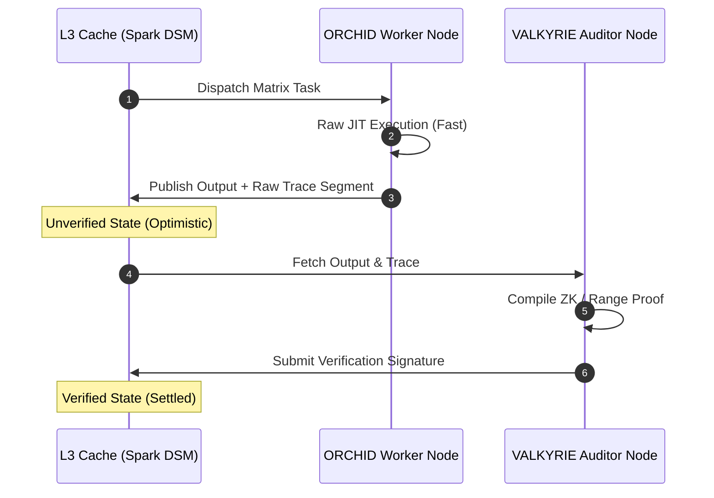
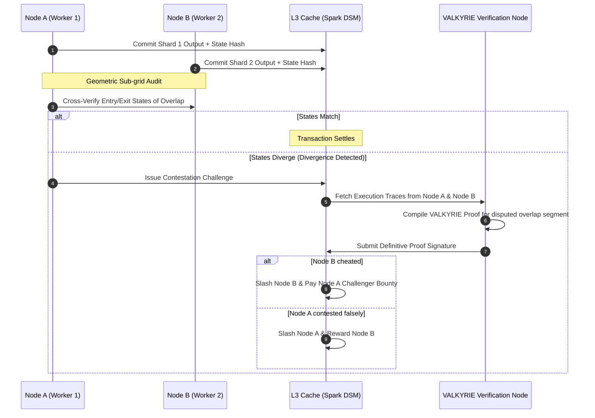

# VALKYRIE Production Deployment & Topology Architecture

This document details the containerization strategies, network communication routes, and deployment topologies for integrating Project **ORCHID** (the bare-metal execution layer) and Project **VALKYRIE** (the out-of-band ZK verification layer) within the **RAMNET** protocol.

---

## 🐋 Docker Container Support for VALKYRIE

VALKYRIE utilizes a multi-stage Docker compilation pipeline to deliver zero-dependency, production-hardened container footprints using distroless runtimes.

```dockerfile
# Stage 1: Build the VALKYRIE Go binary
FROM golang:1.23-bookworm AS builder
WORKDIR /workspace
COPY ORCHID/go.mod ORCHID/
COPY VALKYRIE/go.mod VALKYRIE/
COPY ORCHID/ ORCHID/
COPY VALKYRIE/ VALKYRIE/
WORKDIR /workspace/VALKYRIE
RUN go build -ldflags="-s -w" -o build/valkyrie-proxy cmd/valkyrie-proxy/main.go

# Stage 2: Distroless hardened runtime stage
FROM gcr.io/distroless/cc-debian12:nonroot
WORKDIR /
COPY --from=builder /workspace/VALKYRIE/build/valkyrie-proxy /valkyrie-proxy
COPY --from=builder /workspace/VALKYRIE/circuits /circuits
EXPOSE 9001
ENTRYPOINT ["/valkyrie-proxy"]
CMD ["--mode=server", "--port=9001"]
```

### Why Distroless (cc-debian12) is Mandatory:
*   **Security Gating:** The non-root distroless container completely strips away shell utilities (`/bin/sh`, `/bin/bash`), package managers (`apt`), and standard user rights, making container execution immune to remote shells.
*   **Dynamic Linking Compatibility:** Cryptographic proving backends (such as Plonky3 or Groth16) rely on performance-optimized C/C++ or Rust-based GPU compilation libraries. The `cc` variant of distroless provides essential host runtime bindings (e.g., `glibc`) while retaining maximum security.

---

## 🏛️ Production Communication & Routing Topologies

Since **ORCHID** (standalone compute) and **VALKYRIE** (standalone verifier) are decoupled, we support three primary structural options for routing tasks and validating proofs in production.

### Option 1: The Co-located Sidecar Model (Unified Node)
*Each physical node runs both ORCHID and VALKYRIE as sibling containers/processes.*



*   **Communication:** Inter-Process Communication (IPC) via shared memory maps (`/dev/shm` or anonymous `mmap`) or high-performance local Unix sockets.
*   **Workflow:**
    1.  The Apache Spark L3 Cache layer dispatches a sharded task config to the local node's `valkyrie-proxy` (port `9001`).
    2.  `valkyrie-proxy` strips proof criteria and forwards clean matrix descriptions to `orchid-daemon` (port `9000`).
    3.  `orchid-daemon` executes the computation, writes the output, and outputs execution traces.
    4.  `valkyrie-proxy` intercepts the trace in-memory, compiles the cryptographic proof, and ships the verified payload back to the L3 layer.
*   **Pros:** High integrity. Malicious nodes cannot pollute the L3 cache because tasks are proven *locally* before submission.
*   **Cons:** Higher resource overhead per node (proving costs CPU/GPU cycles that could otherwise be used for raw execution).

---

### Option 2: The Asymmetrical Mesh Model (Worker vs. Auditor Split)
*Nodes are specialized. Execution nodes run only ORCHID; Verification nodes run only VALKYRIE.*



*   **Communication:** Network protocols (e.g., gRPC, Apache Spark streaming, or direct TCP connection) between separate physical machines.
*   **Workflow:**
    1.  Lightweight compute workers run only `orchid-daemon` to execute tasks at maximum speed. They output computed matrix buffers and raw traces to the Spark DSM.
    2.  The network treats these outputs as **optimistically unverified**.
    3.  Dedicated, high-power verification nodes running `valkyrie-proxy` pull raw traces from the DSM, compile the ZK-proofs asynchronously, and submit verification signatures.
*   **Pros:** Maximizes compute throughput. Workers do not waste energy generating proofs; they only do math.
*   **Cons:** Introduces a "settlement delay" (verification lag). If a worker is malicious, its unverified data sits in L3 cache until the auditor runs the circuit and triggers a bisection/slashing event.

---

### Option 3: The Unified Go Wrapper (RAMNET Daemon)
*Users download a single package. The RAMNET daemon imports both ORCHID and VALKYRIE as Go libraries.*

```text
┌────────────────────────────────────────┐
│             RAMNET Client              │
│  ┌──────────────────┐                  │
│  │   ORCHID Core    │ (Matrix Compute) │
│  └──────────────────┘                  │
│  ┌──────────────────┐                  │
│  │  VALKYRIE Core   │ (ZK Prover)      │
│  └──────────────────┘                  │
└────────────────────────────────────────┘
```

*   **Communication:** Direct in-process Go function calls and unsafe pointer sharing.
*   **Workflow:**
    1.  The RAMNET daemon runs as a single binary.
    2.  It uses Go's module integration to call `ORCHID`'s schedulers/emitters and register `VALKYRIE`'s `TraceHook`.
    3.  All handoffs occur in-process, bypassing REST/IPC layers.
*   **Pros:** Simplest distribution footprint (a single binary download). Lowest communication latency.
*   **Cons:** Hard coupling. Any modification in ORCHID's JIT instructions or VALKYRIE's circuit logic requires rebuilding the entire RAMNET client binary.

---

## 🔒 Bridging Geometric Overlap Auditing & ZK Trust Proofs

The RAMNET whitepaper details a decentralized verification scheme utilizing **Geometric Overlap Audit Zones** to ensure computational integrity without $6\times$ replication overhead. When executing tasks across untrusted mesh nodes, VALKYRIE integrates directly into this topology to handle verification and dispute resolution.

```text
       Shard 1 (Processed by Node A)
├───────────────────────────────────────┤
                     ├── Audit Zone ──┤ (Geometric Intersection)
                     └────────────────┼───────────────────────────────────────┤
                                      Shard 2 (Processed by Node B)
```

### The Trust Paradox of Distributed Verification
When distributing tasks:
1.  **Workers cannot verify their own work:** A worker node cannot sign its own proof of correctness without external verification, as it has economic incentives to falsify outputs (e.g., skip CPU-heavy computations but claim the token reward).
2.  **ZK Proofs are mathematically binding:** Crucially, a valid ZK-proof is mathematically unforgeable. Even if compiled by an untrusted worker, the verifier can confirm that the specific trace steps were executed correctly. However, generating ZK-proofs for the entire matrix multiplication is computationally expensive ($10\times$–$100\times$ execution cost), which wastes the worker's hardware resources.

### The Hybrid Solution: Overlap Audit & Non-Interactive Challenger Proofs
To balance worker efficiency with cryptographic trust, RAMNET integrates VALKYRIE in a **dispute-driven hybrid pipeline**:



1.  **Optimistic Execution (ORCHID Core):**
    Nodes execute their designated shards at maximum speed, writing the computation arrays and a serialized trace of the geometric sub-grid intersection to the Spark DSM.
2.  **Sovereign Auditing (Geometric Overlap Zones):**
    Node A audits the geometric intersection segment of Node B. Because Node A and Node B are randomly paired by the scheduler, they cannot collude. Node A checks if Node B's output matches Node A's output in the intersection.
3.  **Valkyrie Non-Interactive Dispute Resolution:**
    If the states diverge, Node A issues a challenge on-chain/in-cache.
    Instead of escalating to slow, multi-round **Verde Bisection Games** or invoking expensive quantum oracle re-execution (Tier 4), the protocol dispatches the contested geometric sub-grid trace to a **VALKYRIE Verification Node** (Auditor).
    The Auditor compiles a ZK/range proof for that contested segment. The ZK verification contract evaluates the proof and immediately slashes the cheater while rewarding the honest node.

---

## 🪙 Game-Theoretic Tokenomics & Slashing Dynamics

To enforce honest participation in the geometric overlap audit zones, RAMNET applies an incentive loop powered by task reward splits and staked security bonds. This game-theoretic design prevents worker fraud, malicious challenges (griefing), and unpaid verification.

### Node Stake Requirements
Before joining the mesh, nodes must lock a **Security Stake (Stake)** in RAMNET tokens:
- **Workers (Nodes A, B, C):** Must stake $S_W$ (Worker Bond) to receive computational task shards.
- **Challengers (Nodes A, B, C acting as auditors):** Must stake $S_C$ (Challenge Bond) to submit audit contestations to the L3 layer.
- **Resolvers (Node D - VALKYRIE):** Must stake $S_R$ (Resolver Bond) to receive proof compilation requests.

---

### 🟢 The Happy Path
Under normal, honest network operation:
1.  A task creator submits a compute task and deposits the **Task Reward Pool** ($R_{\text{total}}$).
2.  The scheduler shards the task across at least three workers: **Worker A**, **Worker B**, and **Worker C**.
3.  Each worker processes exactly $1/3$ of the matrix task, creating natural geometric intersections (e.g., $\frac{M}{3} \times \frac{N}{3}$ sub-grid).
4.  Workers verify adjacent overlaps. If all overlaps match, the transaction settles.
5.  Each worker is paid exactly $1/3$ of the Task Reward Pool ($R_{\text{worker}} = R_{\text{total}} / 3$) directly from the task creator's tokens.
6.  **Node D (VALKYRIE Resolver) is never invoked**, incurring zero computational prover overhead and zero fees.

---

### 🔴 The Unhappy Path (Dispute Settlement)

If adjacent overlap states diverge (e.g. Node A detects a mismatch on Node B's overlap) and a challenge is registered, **Node D (VALKYRIE Resolver)** is triggered to compile and verify a ZK/range proof of the disputed segment.

#### Outcome 1: Worker Fraud Confirmed (Worker B Cheated, Challenger C is Correct)
*VALKYRIE verifier shows Worker B's computation violates mathematical constraints.*
- **Worker B Penalty:** 
  - Worker B forfeits its $1/3$ task reward share ($R_{\text{worker}}$).
  - Worker B's staked Worker Bond ($S_W$) is fully slashed.
  - Worker B is temporarily suspended (Timed Out) from the scheduling mesh.
- **Redistribution of Worker B's Reward Share ($R_{\text{worker}}$):**
  - **90%** ($0.9 \cdot R_{\text{worker}}$) is paid to **Resolver D** to cover ZK-proving compute costs.
  - **10%** ($0.1 \cdot R_{\text{worker}}$) is paid to **Challenger C** as a reward for identifying fraud.
- **Redistribution of Worker B's Slashed Bond ($S_W$):**
  - Paid out as a **bonus extra** on top of the reward shares to compensate **Resolver D** and **Challenger C** for the dispute overhead.

#### Outcome 2: False Contestation Defeated (Worker B is Correct, Challenger C Griefed)
*VALKYRIE verifier shows Worker B's computation was mathematically correct.*
- **Challenger C Penalty:**
  - Challenger C forfeits its $1/3$ task reward share ($R_{\text{worker}}$).
  - Challenger C's Challenge Bond ($S_C$) is fully slashed.
  - Challenger C is suspended and has its auditing reputation rating downgraded.
- **Redistribution of Challenger C's Reward Share ($R_{\text{worker}}$):**
  - **90%** ($0.9 \cdot R_{\text{worker}}$) is paid to **Resolver D** for proof compilation services.
  - **10%** ($0.1 \cdot R_{\text{worker}}$) is paid to **Worker B** as compensation for settlement delay.
- **Redistribution of Challenger C's Slashed Bond ($S_C$):**
  - Paid out as a **bonus extra** to **Resolver D** and **Worker B** on top of their task reward shares.

```text
                     ┌──────────────────────────────┐
                     │   Dispute Settlement Flow    │
                     └──────────────┬───────────────┘
                                    │
                        [VALKYRIE Proof Compiled]
                                    │
                        Is Worker B Math Correct?
                       /                         \
                    YES                           NO
                   /                               \
     [Outcome 2: False Dispute]      [Outcome 1: True Dispute]
     - Slash Challenger C Bond       - Slash Worker B Bond
     - Splitting Challenger's Share: - Splitting Worker's Share:
       * 10% to Worker B               * 10% to Challenger C
       * 90% to Resolver D             * 90% to Resolver D
     - Slashed Bond paid as extra    - Slashed Bond paid as extra
       bonus to Worker B & Resolver D  bonus to Challenger C & Resolver D
```

### Strategic Benefits
1.  **Anti-Griefing Failsafe:** Challengers cannot spam fake disputes against honest workers because they lose their entire challenge stake if the ZK-proof validates the worker's correctness.
2.  **Self-Funded Auditing:** Prover nodes (VALKYRIE) are paid entirely by the party at fault (slashed stakes), ensuring no additional transaction tax is placed on normal users.
3.  **Maximum Mesh Throughput:** Under normal honest network operation, no ZK proofs are compiled, allowing execution to run at raw ORCHID speeds with zero cryptographic overhead.

---

## 🌀 Global Task Scrambling & Functional Sharding

To prevent a single node from reconstructing the complete execution context (which violates the **Logic-Data Decoupling** and **Blind Execution** mandates in the whitepaper), RAMNET aligns ORCHID's local **3-way memory roles** with a global **3-way dimensional sharding** scheme.

Instead of sharding a matrix computation $C = A \times B$ by simple linear index splits (e.g. slicing rows), the CADENCE Routing Engine decomposes and scrambles the task functional dimensions across the 3 worker nodes.

### Local-to-Global Alignment (The 3x3 Grid)

ORCHID locally saturates cache lines by splitting execution into three streams (STREAM-Triad roles): **B-read** (Weights), **C-read** (Activations), and **A-write** (Outputs). Globally, the mesh scrambles the mathematical sharding dimensions so that no node receives the same functional components.

```text
  Global Sharding Split            Functional Context
  ─────────────────────            ──────────────────
  Node A: Row Slicing              Computes C_rows = A_rows * B
  Node B: Column Slicing           Computes C_cols = A * B_cols
  Node C: Reduction Slicing        Computes C_partial = A_inner * B_inner
```

### The 3-Way Dimensional Split
When a task is sharded across **Worker A**, **Worker B**, and **Worker C**:
1.  **Node A (Row Slicing / $A$-dominant):**
    *   Receives only a horizontal slice of $A$ and the full weight matrix $B$.
    *   Computes a horizontal slice of the output $C$.
    *   It has zero visibility into the activations of other rows, preventing it from reconstructuring the global data sequence.
2.  **Node B (Column Slicing / $B$-dominant):**
    *   Receives the full activation matrix $A$ but only a vertical slice of the weight matrix $B$.
    *   Computes a vertical slice of the output $C$.
    *   It has zero visibility into the remaining weights, keeping the global model parameters private.
3.  **Node C (Reduction/Inner-Product Slicing / $K$-dominant):**
    *   Receives only a slice of the inner dimension $K$ for both $A$ and $B$.
    *   Computes a partial sum matrix: $C_{\text{partial}} = \sum_{k \in \text{slice}} A_{ik} B_{kj}$.
    *   It only knows the intermediate reduction products and cannot determine the final outputs or the initial inputs.

---

### Scrambled Role Assignments & Overlap Auditing
To prevent collusion and optimize verification, the scheduler scrambles task roles and maps cross-audit zones at the mathematical intersection boundaries of the three nodes:

-   **Role Scrambling:** The scheduler shuffles which physical node gets which sharding style. For Task 1, Node A might get Row-Slicing, while for Task 2 it gets Reduction-Slicing.
-   **Redundancy (6-Node ECC):** The mirror group (A', B', C') processes identical slices to provide active failover and fault tolerance.
-   **Geometric Intersect Auditing (The 3-Way Audit Zone):**
    The three functional shards naturally intersect at a single sub-tensor space:
    $$\Omega = \left[0:\frac{M}{p}\right] \times \left[0:\frac{N}{q}\right] \times \left[0:\frac{K}{r}\right]$$
    where $p$, $q$, and $r$ represent the number of splits along the Row, Column, and Reduction dimensions respectively.
    
    For the base 3-way split ($p=q=r=3$), the intersection volume represents exactly:
    $$\text{Overlap Volume} = \frac{1}{p \cdot q \cdot r} = \frac{1}{3 \cdot 3 \cdot 3} = \frac{1}{27} \approx 3.7\%$$
    of the global computational workload.
    
    For generalized mesh configurations with $d_1 \times d_2 \times d_3$ splits, the audit volume scales dynamically as $\frac{1}{d_1 \cdot d_2 \cdot d_3}$. At this intersection:
    *   **Node C (Reduction Slice)** outputs the partial sum directly:
        $$C^C_{ij} = \sum_{k=0}^{\frac{K}{r}} A_{ik} B_{kj} \quad \forall i \in \left[0, \frac{M}{p}\right], \, j \in \left[0, \frac{N}{q}\right]$$
    *   **Node A (Row Slice)** computes this exact sum as an intermediate accumulation step ($C^{A, \text{inter}}_{ij}$) before completing the remaining reduction steps.
    *   **Node B (Column Slice)** similarly computes this exact sum as its intermediate accumulation step ($C^{B, \text{inter}}_{ij}$).
    
    The protocol enforces exact mathematical parity across all three nodes:
    $$C^C_{ij} = C^{A, \text{inter}}_{ij} = C^{B, \text{inter}}_{ij} \quad \forall i \in \left[0, \frac{M}{p}\right], \, j \in \left[0, \frac{N}{q}\right]$$

If any divergence is reported in this zone, a dispute is registered. **VALKYRIE Resolver D** compiles the ZK/range proof exclusively for this $\frac{1}{p \cdot q \cdot r}$ sub-tensor slice, identifying the malicious party.


```text
               [3-Way Geometric Audit Zone]

                      Node B (Column Slicing)
                            ┌───┐
                            │   │
                            │   │
    Node A (Row Slicing) ───┼───┼───┐
                            │ █ │   │ <── 3-Way Intersection (3.7% Volume)
                            └───┴───┘     (Node A = Node B = Node C)
                              ▲
                              │
                    Node C (Reduction Slice)
                    Checks intermediate sums
                    along K-axis intersection
```

---

## ⚡ Strategic Benefits
1.  **Anti-Griefing Failsafe:** Challengers cannot spam fake disputes against honest workers because they lose their entire challenge stake if the ZK-proof validates the worker's correctness.
2.  **Self-Funded Auditing:** Prover nodes (VALKYRIE) are paid entirely by the party at fault (slashed stakes), ensuring no additional transaction tax is placed on normal users.
3.  **Maximum Mesh Throughput:** Under normal honest network operation, no ZK proofs are compiled, allowing execution to run at raw ORCHID speeds with zero cryptographic overhead.
4.  **Mathematical Blind Execution:** By scrambling the Row, Column, and Reduction slices, no single node ever holds the full mathematical representation of the task, securing data privacy at the linear-algebra level.

---

## 🏛️ Deployment, Onboarding & Protocol Distribution Architecture

To reconcile the participant experiences across the network, the RAMNET protocol implements a decoupled distribution tier, a flexible user mode execution model, and an out-of-band dispute validation loop.

### 1. Global Distribution Matrix

*   **Tier 1: The RAMNET Desktop Client (GUI Tauri/Electron App):**
    *   **Audience:** Everyday retail developers and edge nodes wishing to monetize idle local GPU/CPU cycles or submit compute tasks via a user-friendly interface.
    *   **Architecture:** A lightweight GUI wrapper running a compiled background `orchid-daemon` and `valkyrie-proxy`. It embeds a Web3 wallet engine (e.g., MetaMask, Solana, WalletConnect) to sign transactions, lock up bonds, and claim rewards.
    *   **Features:** Provides a clean toggle switch for **"Sovereign Local Mode"** (fully isolated, zero fees, self-trusted) vs. **"Mesh Mode"** (contribute idle hardware or pay to allocate tasks across the network).
*   **Tier 2: The RAMNET Headless Engine (Docker & CLI):**
    *   **Audience:** Enterprise data centers, bare-metal server operators, and high-throughput Rubin-class clusters.
    *   **Architecture:** Server operators bypass the GUI entirely, pulling the container directly from the registry: `ghcr.io/digitalserverhost/orchid:latest`.
    *   **Configuration:** Configured purely via standard environment variables or a CLI utility:
        ```bash
        docker run -d \
          -e RAMNET_PAYOUT_ADDRESS="0xKevinWest..." \
          -e RAMNET_MODE="worker" \
          -e STAKED_BOND="10000" \
          ghcr.io/digitalserverhost/orchid:latest
        ```
*   **Tier 3: The Web3 Protocol Dashboard (DApp):**
    *   **Audience:** Remote server operators who want to link headless nodes to their financial identity without exposing private keys.
    *   **Architecture:** Operators run the Tier 2 container, fetch the machine's unique public key, and use the DApp to bind that node ID to their wallet address by signing a cold-storage transaction.

---

### 2. User Mode Matrix

Every node running the RAMNET software operates under one of three execution profiles:

| Profile Mode | Local/Mesh State | Financial Flow | Verification Layer |
| :--- | :--- | :--- | :--- |
| **Sovereign Local** | Fully Isolated | Free ($0 Fees) | None (Self-Trusted Execution) |
| **Mesh Provider** | Joined Mesh | Earns $RAM Tokens | Cross-Audited by Intersecting Slices |
| **Mesh Consumer** | Allocates to Mesh | Pays $RAM Tokens | Fully Encrypted 3-Way Dimensional Sharding |

#### Scaling "Impossibly Large" Tasks
When allocating tasks to the mesh, consumers can dynamically configure the target node count. To maintain mathematical validity under the **3-Way Dimensional Decomposition** model, the target node count must **always scale in multiples of 3** (e.g., 3, 6, 9, 12, etc.). 
*   Higher multiples divide the matrix dimensions into finer slices, enabling massive tasks (which would exceed the memory or compute capacity of any single machine) to be processed across a highly distributed set of nodes.
*   Consumers pay a premium in $RAM tokens to cover orchestration overhead, but gain elastic access to high-performance mesh compute.

---

### 3. Decoupled Auditing & Random VALKYRIE Validation

To ensure mathematical security without compromising bare-metal throughput:
1.  **Self-Audit Isolation:** Nodes executing a task slice can **never** validate their own work.
2.  **Geometric Auditing:** Workers (Node A, Node B, Node C) check each other at their shared intersection boundary ($\Omega \approx 3.7\%$ of the task). If their outputs match, settlement is instant.
3.  **Opt-In Validator Pool:** Nodes check an **"Opt-In to Validation"** setting, downloading the full cryptographic suite (including the **VALKYRIE ZK-proxy**). These nodes listen for network dispute events in exchange for verification rewards.
4.  **Random Dispute Selection:** If an audit zone divergence occurs:
    *   The transaction is frozen.
    *   A VALKYRIE-enabled validator is chosen at random from the pool.
    *   The validator is sent only the tiny execution trace of the contested intersection $\Omega$.
    *   The validator runs VALKYRIE, compiling a ZK-proof or polynomial range check.
    *   The protocol slashes the cheater's bond, rewards the challenger (10% bounty), and pays the validator for compiling the proof.

